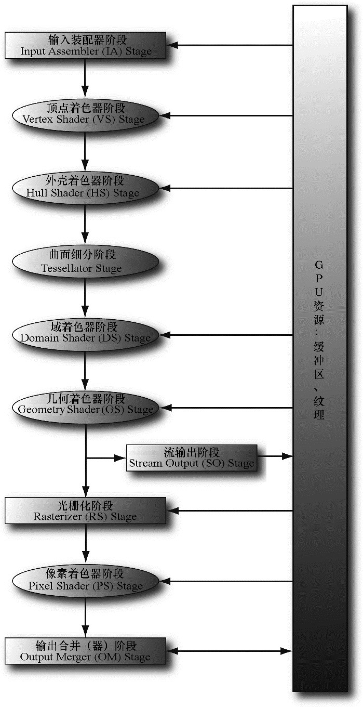
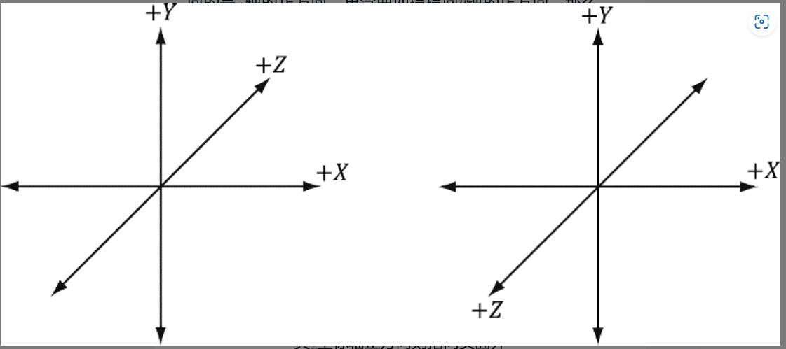

# LearnD3D12

## 先用06章节的Box跑起来

遇到错误“C2102 &要求左值”。最简单的解决方法[csdn链接

[](https://blog.csdn.net/WhoisPo/article/details/112689870)




## 一些语法总结

### 基类和派生类的构造函数

```c++
class D3DApp
{
protected:
    D3DApp(HINSTANCE hInstance);
}

class BoxApp : public D3DApp
{
public:
    BoxApp(HINSTANCE hInstance) : D3DApp(hInstance) {}
}
```

D3DApp是一个类又不是成员变量，为啥呢？

构造函数后的冒号可以引出：

1. 初始化成员变量

2. 调用基类构造函数

   - 自动调用默认构造函数（无参数）
   - 希望基类用非默认构造函数初始化时，需要在派生类的构造函数中显示调用。

   


## 总结Opengl和D3D12的不同

opengl

- **统一变量（Uniform）**：通常使用统一变量来传递 MVP 矩阵。通过 `glGetUniformLocation` 函数获取着色器中 MVP 矩阵统一变量的位置，然后使用 `glUniformMatrix4fv` 函数将矩阵数据传递给该统一变量。示例代码如下：

```C++
// 获取统一变量的位置
GLint mvpLocation = glGetUniformLocation(shaderProgram, "MVP");
// 将矩阵数据传递给统一变量
glUniformMatrix4fv(mvpLocation, 1, GL_FALSE, glm::value_ptr(mvp));
```

**D3D12**

- **上传缓冲区（Upload Buffer）**：需要手动创建上传缓冲区资源，将其映射到 CPU 可访问的内存，然后使用 `memcpy` 函数将 MVP 矩阵数据复制到映射后的内存中。

```C++
// 创建上传缓冲区
ThrowIfFailed(device->CreateCommittedResource(
    &CD3DX12_HEAP_PROPERTIES(D3D12_HEAP_TYPE_UPLOAD),
    D3D12_HEAP_FLAG_NONE,
    &CD3DX12_RESOURCE_DESC::Buffer(sizeof(DirectX::XMMATRIX)),
    D3D12_RESOURCE_STATE_GENERIC_READ,
    nullptr,
    IID_PPV_ARGS(&mUploadBuffer)));

// 映射上传缓冲区
ThrowIfFailed(mUploadBuffer->Map(0, nullptr, reinterpret_cast<void**>(&mMappedData)));

// 复制矩阵数据
memcpy(mMappedData, &mvp, sizeof(DirectX::XMMATRIX));

// 取消映射
mUploadBuffer->Unmap(0, nullptr);
```


- **OpenGL**：OpenGL 使用状态机模型，通过一系列的状态设置函数来管理渲染状态。在传递 MVP 矩阵时，只需要设置统一变量的值，OpenGL 会自动处理状态的切换和管理。例如，在不同的着色器程序之间切换时，OpenGL 会自动更新统一变量的值。
- **D3D12**：D3D12 采用显式的状态管理方式，开发者需要手动管理资源的状态转换。在传递 MVP 矩阵时，需要确保上传缓冲区的状态为 `D3D12_RESOURCE_STATE_GENERIC_READ`，以便 GPU 可以读取数据。同时，还需要使用围栏（Fence）等同步机制来确保 CPU 和 GPU 之间的操作同步。


d3D12是左手系（图左），opengl是右手系（图右）


